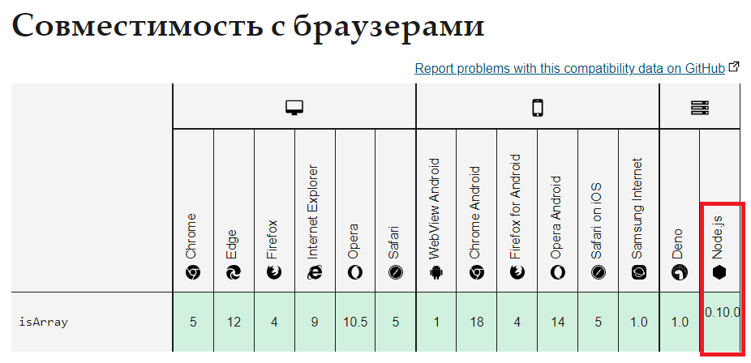

# Советы по подготовке к выполнению алгоритмических задач.

## Установка Node.js.

Для начала нужно установить Node.js. Скачать дистрибутив можно с официального сайта: https://nodejs.org/ru/ .


Рекомендую качать версию LTS(Long-Term Support или длительный срок поддержки). Если вам нужна другая версия, то нажмите на "Другие загрузки" или перейдите по ссылке https://nodejs.org/ru/download/ .

Во время установки не рекомендую ничего менять.


NPM устанавливается вместе с Node.js.


## Выполнение алгоритмических задач.

Для начала нужно перейти на страницу задачи. Для примера задача **Human Readable Number**:


Перейдите на GitHub репозиторий задачи и сделайте его форк себе, нажав на кнопку **Fork**:


Затем клонируйте себе на компьютер репозиторий:


```bash
git clone git@github.com:UserName/human-readable-number.git
```
Где UserName - ваш ник на GitHub.
После клонирования перейдите в директорию задачи коммандой:
```bash
cd human-readable-number
```


И установите зависимости:
```bash
npm install
```


Красным выделенно сообщение **For this task we are strictly recomend you to use node <=12. Now you are using node v16.13.2, if you are using any of features that not supported by node <=12, score won't be submitted** говорящее о том, что рекомендуют использовать Node.js с версией меньше или равной 12. Если не использовать методы появившиеся в Node.js позже 12 версии - это не критично. Как узнать в какой версии появилась поддержка того или иного метода будет показано в конце статьи.

## Процесс работы с репозиторием задачи.

Ваше решение задачи нужно записать в файл `index.js` в директории `src`, строго в данной там функции:
```js
module.exports = function toReadable (number) {
  
}
```

Это нужно для работоспособности тестов и автотеста в рсапп.

Для запуска тестов запустите в терменале:
```bash
npm test
```


Результат успешных тестов будет такой:


Если тесты не прошли - то такой:


Где **Should return 'one' when 1** говорит о том, что тест ожидает получить **one** если на входе **1**. **undefined** **==** **'one'**: **undefined** - что ваш код выдает, **'one'** - что тест ожидает.

После того как вы решите задачу и все тесты будут проходить успешно не забудьте запушить изменения на GitHub.

## Как узнать в какой версии появилась поддержка того или иного метода.

Наберите название метода в поисковой системе, например Google, и перейдите на сайт MDN (Mozilla Developer Network):


Опуститесь в низ страницы до раздела **Совместимость с браузерами**:



Крайняя правая колонка показывает начиная с какой версии Node.js началась поддержка данного метода.